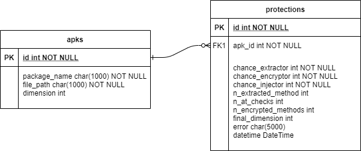

# Experiments

This folder contains the details of the Android apps used during our experimental phase and the relative results.

In particular:
* *marvel_protection_backup.sql* is the final backup of the database storing the MARVELoid protection results. For each apk, the `protections` table contains i) protection results - i.e., the number of a) base IATs, b) IATs with encryption, c) and methods involved in the code splitting process, ii) the protection overheads - i.e., execution time and final size (in byte), and iii) the stack-trace of every error occured during the protection;
* *sha256_package.txt* contains the pair (sha256, package name) for each app in the test-set;
* *example_apps* is a folder containing a random-selected subset of 20 apps from our test-set.  

The following figure shows the ER schema of the database used in the experimental campaign of MARVELoid.

In particular, the database contains two tables:
* `apks` - Contains the information the Android app of the test-set
  * `package_name` - The package name of the app;
  * `file_path` - The path in the filesystem;
  * `dimension` - The size of the original app expressed in byte.
* `protections` - Contains the information of the MARVELoid protection results applyed to an app:
  * `chance_extractor` - The chance (percentage) to perform the code splitting of an app's method;
  * `chance_protector` - The chance (percentage) to create an IAT with encryption;
  * `chance_injector` - The chance (percentage) to create a base IAT;
  * `n_extracted_methods` - The number of methods involved in the code splitting process;
  * `n_at_checks` - The number of base IATs;
  * `n_encrypted_methods` - The number of IAT with encryption;
  * `final_dimesion` - The size of the protected app expressed in byte;
  * `error` - The stack trace of MARVELoid if some errors occurs during the protection process;
  * `datetime` - The date of the entry creation. 

The corresponding python classes are specified in the [models.py](../Docker/models.py) file.
